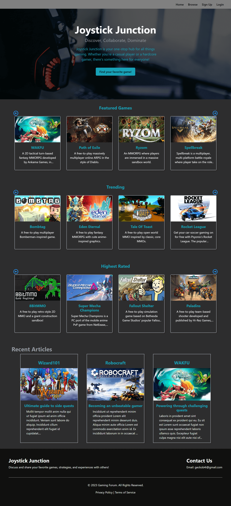
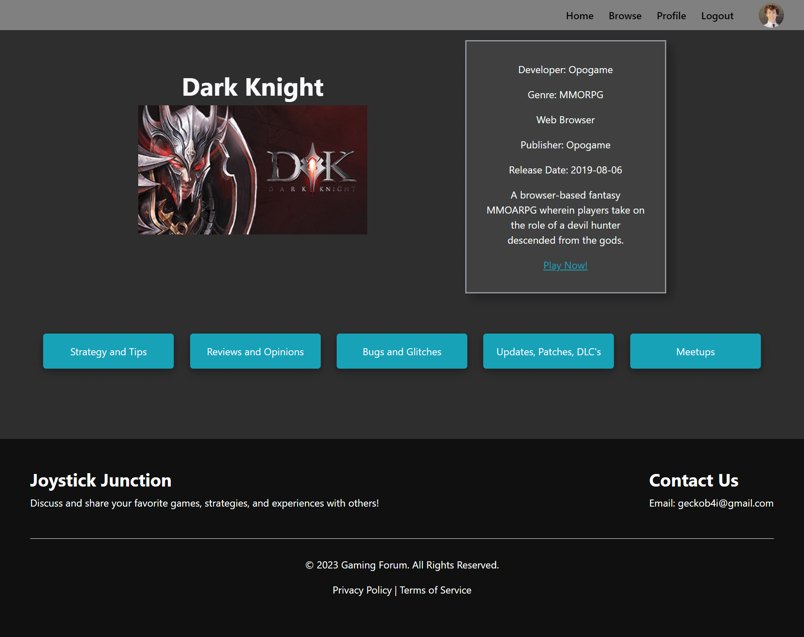
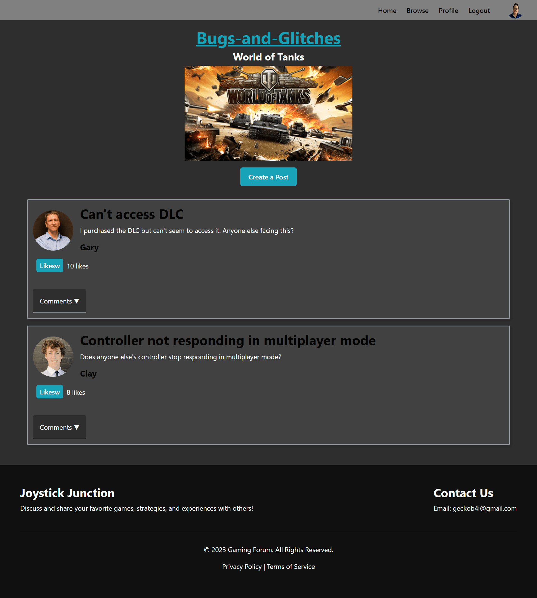

# **Joystick Junction**

Image of the Home Page.The users can choose to browse games, explore featured games via a carousel, or read recent gaming articles.
## **Table of Contents**
- [License](#license)
- [Project Overview](#project-overview)
- [Browse](#browse)
- [Game Page](#game-page)
- [Category Page](#category-page)
- [Purpose and Inspiration](#purpose-and-inspiration)
- [Unique Technologies](#unique-technologies)
- [Technologies Used](#technologies-used)
- [Deployment](#deployment)

## **License**
This project is licensed under the MIT license.

## **Project Overview**
Joystick Junction is a comprehensive video game blog and community platform, offering a unique blend of social interaction, in-depth articles, and game exploration. Leveraging advanced features such as a debouncing search functionality and a filter system for game types, it ensures a smooth and user-friendly experience. Users can also engage in rich discussions through six distinct categories for each game. This seamless integration of technology, gaming, and community-building caters to diverse interests, making Joystick Junction a compelling project for both technically proficient and non-technical audiences alike.

## **Browse**

The user can enter a name of a game or choose to select the categories they wish to have in their game.

## **Game Page**

The user can choose to play or checkout what other users have to say about the game.
## **Category Page**

The user can create a post or comment on others posts / comments. Mock users have been created to simulate real users.

## **Purpose and Inspiration**
In creating Joystick Junction, I sought a new challenge. The thought of building a blog from scratch was both exciting and daunting - I knew it wouldn't be easy, but that was the thrill of it. The end goal was not just about expanding my portfolio but about learning new skills that could push me to the next level of web development.

## **Unique Technologies**
**Cloundinary** 
Cloudinary is a cloud-based service that provides an end-to-end solution for a website's entire image and video-related needs. This includes everything from uploads, storage, manipulations, optimizations to delivery. It helps manage web assets in a highly scalable and secure way, supporting quick uploads and transformations to media assets. Its API allows seamless integrations into any app, offering faster loading times and optimized delivery across different devices and geographical locations.

**Express-Sessions** 
Express-sessions is a Node.js module that is used for handling session data. Session data is server-side data which the application saves and retrieves when the user accesses the application. It's a crucial tool for maintaining state in stateless HTTP protocols. It offers compatibility with various session stores such as memory storage, database storage, file-based storage and more. It's very popular for managing user identities, shopping cart data, and other temporary but sensitive information.

**bcrypt** 
Bcrypt is a powerful, adaptive password hashing function designed to protect against brute-force and rainbow table attacks. It works by hashing passwords with a salt, which is a random piece of data used to protect passwords against pre-computed hash attacks. The "adaptive" part of bcrypt is important as well: over time, as computers become more powerful, bcrypt's hashing algorithm can increase its complexity, ensuring that stored passwords remain secure long into the future.

**Free To Play Games Database API** 
Free to Play Games Database API is a dynamic, user-friendly API that offers a comprehensive collection of free-to-play video games data. This API provides developers with structured access to a wealth of information about various games, including details like title, genre, developer, platform, release date, and more. It's an excellent tool for developers looking to create applications or platforms centered around gaming, providing easy access to regularly updated, valuable data. Its versatility and reliability make it a key resource in the development of any gaming-focused web project.

## **Technologies Used**
Font End  
* React.js
* JavaScript
* CSS
* HTML
* Cloudinary
* React-Bootstrap
* React-Modal
* Free To Play Games Database API 

Back End
* Node.js
* SQL
* Sequelize
* Express-Sessions
* bcrypt

## **Deployment**
[Deployment Link](https://joystick-junction-production.up.railway.app/)